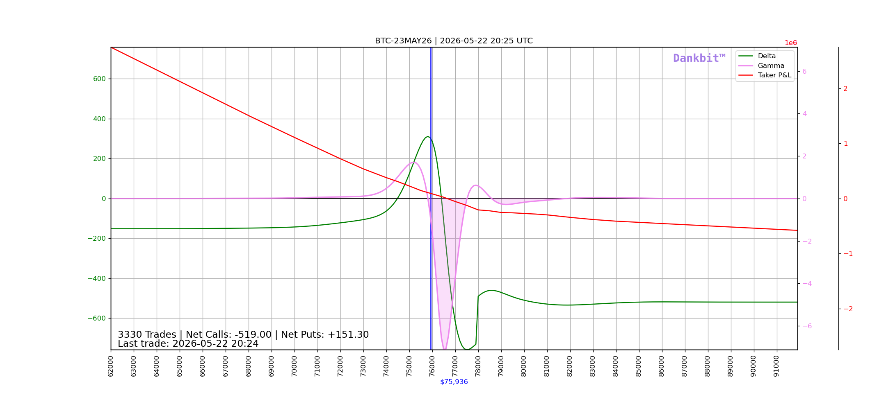

# Dankbit

Options flow analytics for Deribit — built on Odoo 18.

Ingests BTC and ETH options trades in real time and renders Delta and Dollar Gamma (GEX) curves across a configurable price range. Designed for spotting gamma walls, pin risk, and dealer hedging pressure ahead of expiry.



---

## What it shows

| Curve | Colour | Description |
|---|---|---|
| Delta | Green | Aggregate taker portfolio delta across spot prices |
| Gamma (GEX) | Violet | Dollar gamma — `Γ × S²` — dealer hedging pressure |
| Taker P&L | Red | Aggregate payoff at expiry (optional) |

The blue vertical line marks current spot. Current delta at spot is shown below the chart.

**Reading the gamma curve:** negative GEX means takers are net short gamma → market makers are net long gamma → MMs sell into rallies and buy dips, pinning spot. The deepest trough is the primary gamma wall.

**Trading futures with GEX:**
- **Avoid directional trades when GEX is negative** (violet filled area) — MMs are net long gamma and hedge by fading every move. The market tends to pin and mean-revert. Breakouts fail.
- **Prefer directional trades when GEX is positive** (no fill) — MMs are net short gamma and must hedge pro-cyclically (buy into rallies, sell into dips), adding fuel to trending moves.

---

## Architecture

```
Deribit WebSocket API  ──►  dankbit_ws (Python)  ──►  PostgreSQL
                                                            │
                                                        Odoo 18
                                                            │
                                                     /<instrument>
```

Two Docker services:

- **`web`** — Odoo 18 with the `dankbit` addon. Serves chart pages and the Odoo backend.
- **`dankbit_ws`** — Lightweight Python service. Connects anonymously to Deribit's public WebSocket and streams option trades directly into PostgreSQL.

---

## URLs

| URL | Description |
|---|---|
| `/BTC-7MAY26` | BTC options for a specific expiry |
| `/ETH-30MAY26` | ETH options for a specific expiry |
| `/help` | Payoff diagram reference |

Always navigate to a specific expiry. `/BTC` and `/ETH` without an expiry aggregate all trades across all expiries and produce a meaningless chart.

Query parameters: `from_price`, `to_price`, `width`, `height`.

Charts auto-refresh every 5 minutes by default (configurable in Settings).

---

## Setup

### Prerequisites

- Docker and Docker Compose
- Deribit API credentials (`DERIBIT_KEY`, `DERIBIT_SECRET`) — set in `.env`

### 1. Clone

```bash
git clone https://github.com/fshahy/dankbit.git
cd dankbit
```

### 2. Set permissions

```bash
export UID=$(id -u)
export GID=$(id -g)
```

### 3. Start

```bash
docker compose up -d
```

### 4. Initialise Odoo

Open `http://localhost:8069`, create a database (any name — set `DANKBIT_POSTGRES_DB` in `.env` to match), then install the **Dankbit** app from the Apps menu.

### 5. Enable cron jobs

Two scheduled actions run automatically once a day:

- **Dankbit - Get Last Trades** — ensures no trades were missed (e.g. during brief downtime) by pulling recent history from the Deribit REST API
- **Dankbit - Delete Expired Trades** — archives expired instruments

The WebSocket service (`dankbit_ws`) handles real-time ingestion automatically on startup.

---

## Configuration

Settings → Dankbit:

| Parameter | Description | Default |
|---|---|---|
| From Price (BTC) | Left edge of BTC chart | 100,000 |
| To Price (BTC) | Right edge of BTC chart | 150,000 |
| Steps (BTC) | Price step size | 100 |
| From / To / Steps (ETH) | Same for ETH | 2000 / 5000 / 50 |
| Refresh Interval | Page auto-refresh in seconds | 60 |
| Deribit API timeout | HTTP request timeout | 5s |
| Greeks min time (hours) | Floor on T to avoid singularity | 1h |

---

## Stack

- **Odoo 18** — web framework, ORM, scheduler
- **PostgreSQL 14** — trade storage
- **matplotlib / numpy / scipy** — server-side chart rendering (no pyplot, Agg backend)
- **websockets** — anonymous Deribit WebSocket client
- **Docker Compose** — single-command deployment

---

## Project layout

```
dankbit/
├── my_addons/dankbit/
│   ├── controllers/
│   │   ├── main.py          # HTTP routes → chart PNG
│   │   ├── delta.py         # Black-Scholes delta aggregation
│   │   ├── gamma.py         # Dollar gamma (GEX) aggregation
│   │   └── options.py       # Matplotlib figure builder
│   ├── models/
│   │   └── trade.py         # Trade model, Deribit REST fetcher
│   └── wizard/
│       └── plot_wizard.py   # Backend plot wizard for selected trades
├── dankbit_ws_service/
│   └── dankbit_ws_batch.py  # WebSocket trade ingester
├── config/
│   └── odoo.conf
└── docker-compose.yml
```

---

## License

MIT
